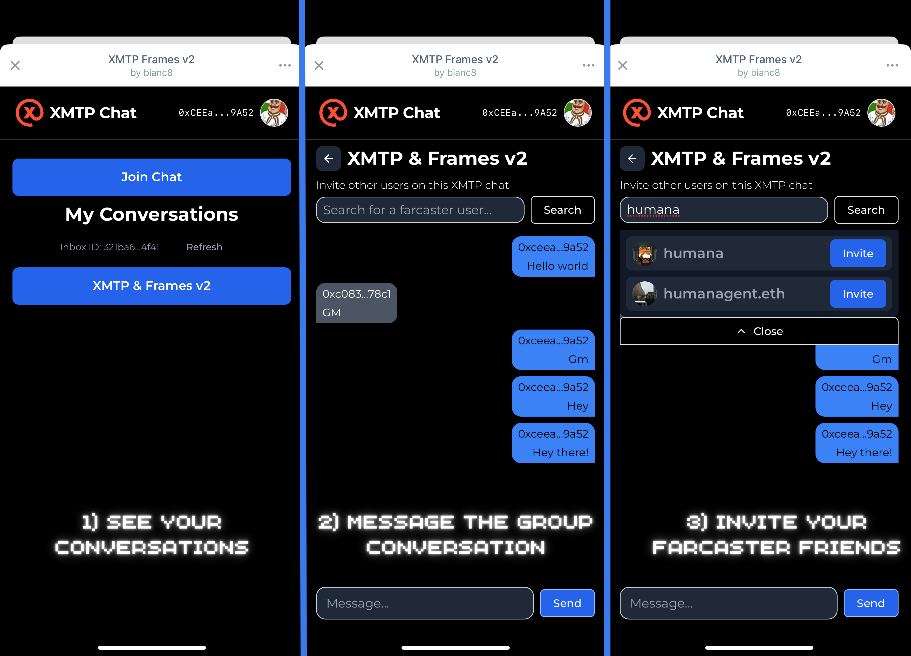

# XMTP x Framesv2 with Next.js

A Farcaster Framesv2 with XMTP private chat integration.



## Getting Started

This Farcaster Frame is a [Next.js](https://nextjs.org) project bootstrapped with the [`Builders Garden miniapp template`](https://github.com/builders-garden/miniapp-next-template), you can find more information about the template [here](https://frames-v2.builders.garden).

## Prerequisites

- Node.js >=20
- Yarn @4.6.0 package manager
- A Farcaster account on your phone


## Local Development

First, run the development server:

```bash
yarn dev
```

Then, you can run the frames.js debugger, from there you can enter the NEXT_PUBLIC_URL (eg. http://localhost:3000) and see the frame embed and interact with it:

```bash
yarn frames
```

## Environment Variables

To run the frame you need to create a .env.local file with the following variables:

First, copy the `.env.example` file to `.env.local`.
```bash
cp .env.example .env.local
```

1. Update the `NEXT_PUBLIC_URL` environment variable with your local/production URL.
2. Since farcaster frames (and miniapps in general) dont have a console, you can use [Eruda](https://github.com/liriliri/eruda) to debug the app. Set the `NEXT_PUBLIC_APP_ENV` environment variable to `development` to enable it.
3. Go to [Neynar](https://neynar.com/) and generate a *FREE* API key.
4. Generate a JWT secret and copy it to the `.env.local` file.
  ```bash
  openssl rand -base64 32
  ```
1. With a fresh wallet/private key that you wont use anywhere else, go to [XMTP](https://xmtp.chat/) and create a group conversation on the XMTP environment you want to use (**dev** or **production**).
2. Send a message to the group and click on the message to copy the conversation id of the group.
3. Update the `NEXT_PUBLIC_XMTP_DEFAULT_CONVERSATION_ID` environment variable with the conversation id of the XMTP group you want to use.
4. Update the `XMTP_PRIVATE_KEY` environment variable with the private key of the account you have freshly created.
5. Update the `XMTP_ENV` environment variable with the XMTP environment you want to use.
6.  `XMTP_ENCRYPTION_KEY` is the encryption key of the @xmtp/node-sdk client, it is optional because it is generated automatically by the XMTP client, so you can leave it blank for the first time you run the app. But it is recommended to use the same encryptionKey for the xmtp/node-sdk client, so once it will be generated via clicking on "Join conversation" button on the frame, copy it from the console and paste it here.

## Testing the frame

Once you setup the environment variables, you can run the frame by doing `yarn dev`.
In order to access the frame from Farcaster, you need to deploy it to a public URL or expose your local environment to the internet, for that you can use [ngrok](https://ngrok.com/) or [cloudflare tunnel](https://developers.cloudflare.com/cloudflare-one/connections/connect-networks/do-more-with-tunnels/local-management/create-local-tunnel/).

### Using frames.js debugger
While you are running the frame with `yarn dev` you can use the frames.js debugger to test the frame by entering the NEXT_PUBLIC_URL (eg. https://localhost:3000) and see the frame embed and interact with it.
Just open a new terminal tab and run:
```bash
yarn frames
```

### Using localtunnel
If you have set the .env.local variable as provided in .env.example, with USE_TUNNEL set to true and NEXT_PUBLIC_URL set to `https://localhost:3000`, the `yarn dev` command will automatically start a localtunnel tunnel and you can access the frame from Farcaster using the localtunnel URL.
Then you can:
1. Go to the [warpcast frames dev dashboard](https://warpcast.com/~/developers/frames)
2. Scroll down to the "Preview Frame" tool
3. Enter this URL: `https://localhost:3000`
4. Click "Preview" to test your frame

### Using ngrok
Go to [Ngrok Dashboard](https://dashboard.ngrok.com/), download and install ngrok, then obtain a custom static domain for your ngrok tunnel, so you will be able to access the frame from Farcaster using this custom domain name.
```bash
ngrok http --url=your-custom-domain.ngrok-free.app 3000
```
or if you want to use ngrok with USE_TUNNEL set to true, you can use the following command:
```bash
ngrok http https://localhost:3000 --host-header="localhost:3000"
```

Now update the `NEXT_PUBLIC_URL` environment variable on `.env.local` with the ngrok static URL.

### Using Cloudflare Tunnel
Follow the steps on [Cloudflare Tunnel](https://developers.cloudflare.com/cloudflare-one/connections/connect-networks/do-more-with-tunnels/local-management/create-local-tunnel/) to create a tunnel and obtain a custom domain name.

Basic steps:
0. Add your website to Cloudflare
1. Change your domain nameservers to Cloudflare ones
2. Install `cloudflared`
  ```bash
  brew install cloudflared
  ```
3. Authenticate to Cloudflare
  ```bash
  cloudflared tunnel login
  ```
4. Create config.yml file, update the `<Tunnel-UUID>` with the tunnel UUID you obtained from the Cloudflare Tunnel dashboard.
  ```bash
  echo """url: http://localhost:3000
  tunnel: <Tunnel-UUID>
  credentials-file: /root/.cloudflared/<Tunnel-UUID>.json""" > config.yml
  vi config.yml
  ```
5. Start routing traffic
  ```bash
  cloudflared tunnel route dns <UUID or NAME> <hostname>

  # OR

  cloudflared tunnel route ip add <IP/CIDR> <UUID or NAME>
  ```
6. Run the tunnel
  ```bash
  cloudflared tunnel run <UUID or NAME>
  ```
7. Check the tunnel
  ```bash
  cloudflared tunnel info <UUID or NAME>
  ```
8. Update the `NEXT_PUBLIC_URL` environment variable on `.env.local` with the Cloudflare Tunnel static URL.

## Deploy

This is a standard Next.js app, so you can deploy it to any hosting provider you want, you can choose how to deploy it on [this guide](https://nextjs.org/docs/14/app/building-your-application/deploying).

### Using Vercel
The easiest way to deploy your Next.js app is to use the [Vercel Platform](https://vercel.com/).
